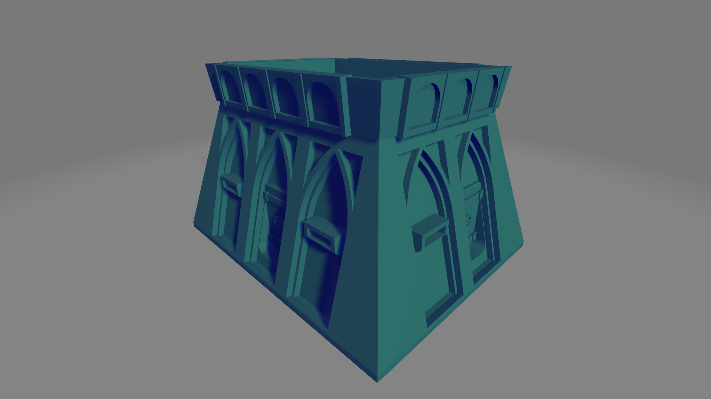

# skirmishbunker
python Library for making a skirmish wargame bunker

## Documentation
[Thorough writeup of the development of the bunker](./documentation/README.md)

## Dependencies
* [CadQuery 2.1](https://github.com/CadQuery/cadquery)
* [cqMore](https://github.com/JustinSDK/cqMore)
* [cadqueryhelper](https://github.com/medicationforall/cadqueryhelper)
* [cqterrain](https://github.com/medicationforall/cqterrain)

### Installation
To install skirmishbunker directly from GitHub, run the following `pip` command:

	pip install git+https://github.com/medicationforall/skirmishbunker

**OR**

### Local Installation
From the cloned skirmishterrain directory run.

	pip install ./
