# Bunker Development

## Inspiration

https://www.reddit.com/r/PrintedMinis/comments/rgb3ln/i_painted_a_classic_warhammer_40k_bunker/


https://www.pinterest.com/pin/bunker-part-2--483855553698959743/


---
## What We're Going To Build

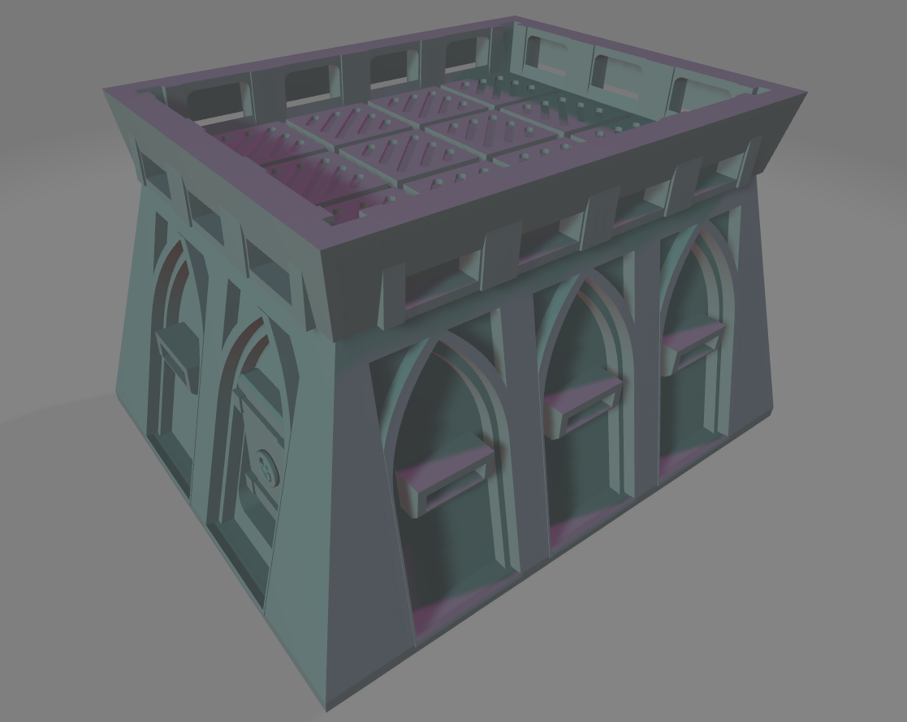

### Demonstration Video Link
[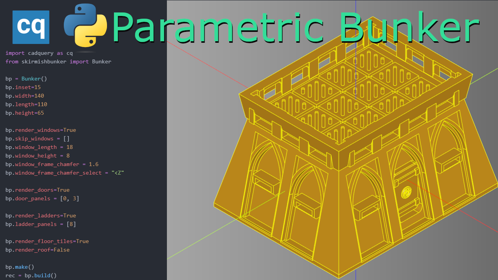](https://www.youtube.com/watch?v=UXTRrt9OsbQ)

[https://www.youtube.com/watch?v=UXTRrt9OsbQ](https://www.youtube.com/watch?v=UXTRrt9OsbQ)

---
## All Your Base
[src code](../src/skirmishbunker/Base.py)

**Base** is the class parent that the project will inherit from.<br />
There are two lifecycle methods **make** and **build**. For all intents **base** derived classes are factories for making cadquery solids.

* **make** creates the parts off of class parameter values.
* **build** assembles the made parts onto a cadquery workplane.

If you call **build** without calling **make** an exception will be thrown.<br />
You can call **make** multiple times.

``` python
class Base:
    def __init__(self):
        self.width = 75
        self.length = 75
        self.height = 75
        self.make_called = False

    def make(self):
        self.make_called = True

    def build(self):
        if self.make_called == False:
            raise Exception('Make has not been called')

    def dimensions(self):
        return (self.length, self.width, self.height)
```
---

## Making The Outline
* Create the wedge outline, this is part of the blocking process.

[Code Example 01 - Outline](../example/ex_01_outline.py)

``` python
import cadquery as cq
from cadqueryhelper import shape
from skirmishbunker import Base

class Bunker(Base):
    def __init__(self):
        super().__init__()
        self.length = 100
        self.width = 100
        self.height = 75

        self.inset = 10

        self.wedge = None

    def make_wedge(self):
        self.wedge = (
            cq.Workplane("XY" )
            .wedge(self.length,self.height,self.width,self.inset,self.inset,self.length-self.inset,self.width-self.inset)
            .rotate((1,0,0),(0,0,0),-90)
        )

    def make(self):
        super().make()
        self.make_wedge()

    def build(self):
        super().build()
        scene = (
            cq.Workplane("XY")
            .union(self.wedge)
        )
        return scene

bp = Bunker()
bp.make()
rec = bp.build()

show_object(rec)
```


---
## Determine Wall Angle

* Calculate arccosine of base to inset angle.
* As a proof of concept I'm aligning a box to the exterior angled wall.

[Code Example 02 - Angle Test](../example/ex_02_angle.py)

### Add import
``` python
from cqterrain import roof
```

### New \_\_init__ Parameter
``` python
    self.angle = 0
```

### Angle Code From cqterrain roof
``` python
def angle(self, length, height):
    '''
    Presumed length and height are part of a right triangle
    '''
    hyp = math.hypot(length, height)
    angle = length/hyp
    angle_radians = math.acos((angle))
    angle_deg = math.degrees(angle_radians)
    return angle_deg
```

### Update make
``` python
def make(self):
    super().make()
    self.angle =roof.angle(self.inset, self.height)

    self.make_wedge()

    # Add example box
    box = cq.Workplane("XY").box(10,10,10).rotate((0,1,0),(0,0,0),-1*(self.angle)).translate((self.length/2,0,0))
    self.wedge = self.wedge.add(box)
```


### Generate examples

#### Inset 40
``` python
bp = Bunker()
bp.inset=40
bp.make()
rec = bp.build()
```


#### Inset 10

``` python
bp = Bunker()
bp.inset=10
bp.make()
rec = bp.build()
```


---

## Cut Out Interior
* I wanted a square interior as opposed to shelling the wedge outline.

[Code Example 03 - Interior](../example/ex_03_interior.py)

### New \_\_init__ Parameter

 ``` python
 self.int_length = None
 self.int_width = None

 self.inset = 20
 self.interior_rectangle = None
 ```

### Create interior_rectangle

``` python
def make_interior_rectangle(self):
    self.int_length = self.length - (2*(self.inset+self.wall_width))
    self.int_width = self.width - (2*(self.inset+self.wall_width))

    if self.inset < 0:
        self.int_length = self.length - (2*(self.wall_width))
        self.int_width = self.width - (2*(self.wall_width))

    self.interior_rectangle = (
        cq.Workplane("XY")
        .box(self.int_length, self.int_width, self.height-self.wall_width)
        .translate((0,0,self.wall_width/2))
    )
```

### Update make

``` python
def make(self):
    super().make()
    self.angle =roof.angle(self.inset, self.height)

    self.make_wedge()
    self.make_interior_rectangle()

    # Add example box
    box = cq.Workplane("XY").box(10,10,10).rotate((0,1,0),(0,0,0),-1*(self.angle)).translate((self.length/2,0,0))
    self.wedge = self.wedge.add(box)
```

### Update build
``` python
def build(self):
    super().build()
    scene = (
        cq.Workplane("XY")
        .union(self.wedge)
        .cut(self.interior_rectangle)
    )
    return scene
```


### Width Test
``` python
bp = Bunker()
bp.inset=20
bp.width=150
bp.make()
rec = bp.build()
```


---
## Cut Panels
* Create the outline rectangles where the bunker details will go.

[Code Example 04 - Cut Panels](../example/ex_04_cut.py)

### update import
``` python
from cadqueryhelper import shape, series
```

### Add import
``` python
from math import floor as math_floor
```

### New \_\_init__ Parameters
``` python
self.wall_width = 5
self.panel_length = 28
self.panel_width = 6
self.panel_padding = 4

self.cut_panels = None
```

### Add make_series method
``` python
def make_series(self, shape, length_offset, x_translate=0, y_translate=0, z_translate=0, skip_list=None, keep_list=None):
      length = self.int_length
      width = self.int_width
      padding = self.panel_padding
      inset = self.inset
      p_width = self.panel_width

      x_panels_size = math_floor(length / (self.panel_length + self.panel_padding))
      y_panels_size = math_floor(width / (self.panel_length + self.panel_padding))

      x_shapes = series(shape, x_panels_size, length_offset=length_offset)
      y_shapes = series(shape, y_panels_size, length_offset=length_offset)

      x_plus = (
          cq.Workplane("XY").add(x_shapes)
          .translate((0, y_translate, z_translate))
      )

      x_minus = (
          cq.Workplane("XY").add(x_shapes)
          .rotate((0,0,1),(0,0,0),180)
          .translate((0, -1*y_translate, z_translate))
      )

      y_plus = (
          cq.Workplane("XY").add(y_shapes)
          .rotate((0,0,1),(0,0,0),90)
          .translate((x_translate, 0, z_translate))
      )

      y_minus = (
          cq.Workplane("XY").add(y_shapes)
          .rotate((0,0,1),(0,0,0),90)
          .rotate((0,0,1),(0,0,0),180)
          .translate((-1*(x_translate), 0, z_translate))
      )

      scene = x_plus.add(y_plus).add(x_minus).add(y_minus)

      if skip_list and len(skip_list) > 0:
          solids = scene.solids().vals()
          scene = cq.Workplane("XY")

          for  index, solid in enumerate(solids):
              if index not in skip_list:
                  scene.add(solid)
      elif keep_list and len(keep_list) > 0:
          solids = scene.solids().vals()
          scene = cq.Workplane("XY")

          for  index, solid in enumerate(solids):
              if index in keep_list:
                  scene.add(solid)

      return scene
```

This code is involved and went through numerous iterations.
* Takes a provided shape and duplicates it across all four walls of the bunker.
* Can have skip list for instances to skip
* can have a keep list for instances to keep
* The reference index for what can be skipped or kept is derived from the width and length of the bunker.
* See below example 10 Skip Windows - for further details.


### Generate Cut Panels

``` python
def make_cut_panels(self):
    height = self.height
    p_length = self.panel_length
    p_width = self.panel_width
    padding = self.panel_padding
    p_height = height - padding

    cut_panel = (
    cq.Workplane("XY")
        .box(p_length, p_width, p_height)
        .translate((0,-1*(p_width/2),1*(p_height/2)))
        .rotate((1,0,0),(0,0,0),self.angle-90)
        .translate((0,0,-1*(height/2)))
    )

    x_translate = self.length/2
    y_translate = self.width/2
    self.cut_panels = self.make_series(cut_panel, length_offset=self.panel_padding*2, x_translate=x_translate,y_translate=y_translate, z_translate=0)
```

### Update make
``` python
def make(self):
    super().make()
    self.angle =roof.angle(self.inset, self.height)

    self.make_wedge()
    self.make_interior_rectangle()
    self.make_cut_panels()
```

### Update build
``` python
def build(self):
    super().build()
    scene = (
        cq.Workplane("XY")
        .union(self.wedge)
        .cut(self.interior_rectangle)
        .cut(self.cut_panels)
    )
    return scene
```

### Build the bunker
``` python
bp = Bunker()
bp.inset=20
bp.width=150
bp.length=120
bp.panel_width = 6
bp.panel_padding = 4
bp.make()
rec = bp.build()
```


This code was a pain to get right. <br />Below is further inset testing.

#### Inset 0
``` python
bp.inset=0
bp.panel_width = 4
```

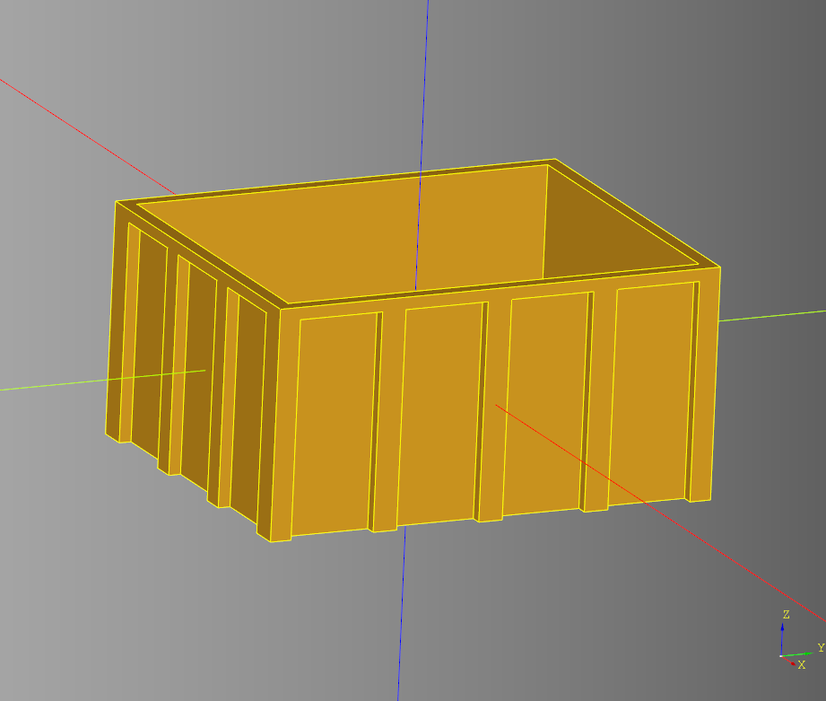


#### Inset 30
``` python
bp.inset=30
```
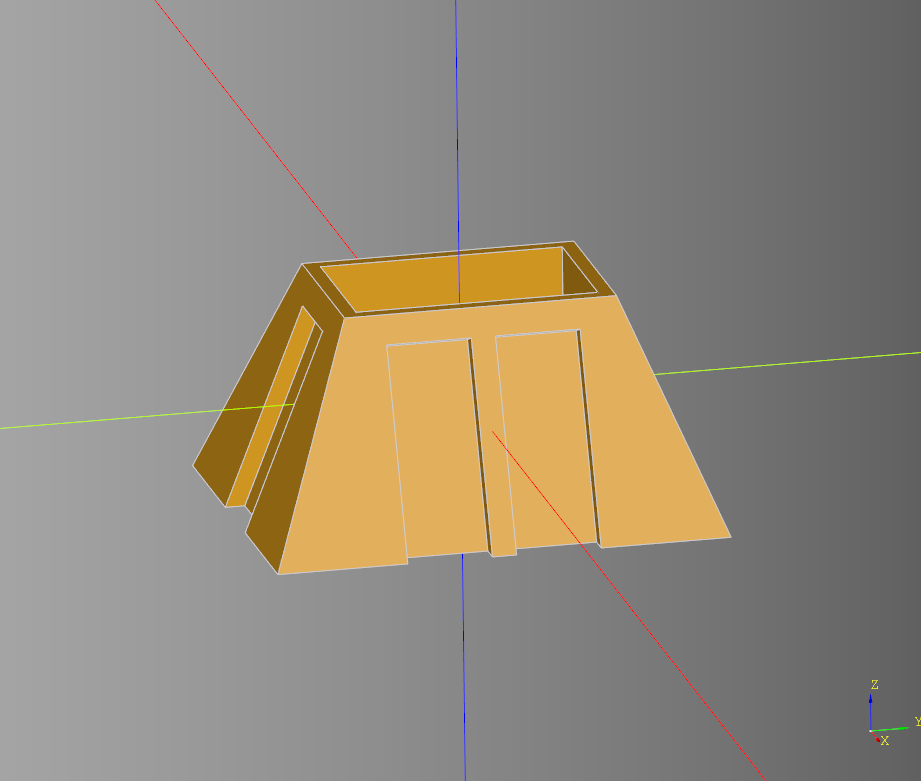

#### Inset -30
``` python
bp.inset=-30
```
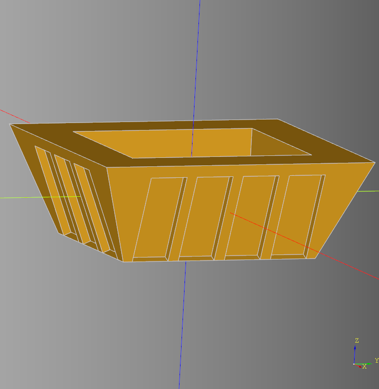

---

## Create Arch Detail

[Code Example 05 - Arch Detail](../example/ex_05_arch_detail.py)

### New \_\_init__ Parameters
``` python
self.arch_padding_top = 3
self.arch_padding_sides = 3
self.arch_inner_height = 6
self.inner_arch_top = 5
self.inner_arch_sides = 4

self.panels = None
self.cut_panels = None
```

### Arch Details
``` python
def arch_detail(self):
    height = self.height
    p_length = self.panel_length
    p_width = self.panel_width
    padding = self.panel_padding

    panel_outline = cq.Workplane("XY").box(p_length, p_width, height - padding)
    arch = shape.arch_pointed(p_length+self.arch_padding_sides, p_width/2 , height - padding + self.arch_padding_top, ((height - padding)/2) + self.arch_inner_height).translate((0,-1*(p_width/4),0))
    inner_arch = shape.arch_pointed(p_length + self.arch_padding_sides - self.inner_arch_sides, p_width , height - padding + self.arch_padding_top - self.inner_arch_top, ((height - padding)/2) + self.arch_inner_height - self.inner_arch_sides)
    inner_inner_arch = shape.arch_pointed(p_length + self.arch_padding_sides - self.inner_arch_sides-3, p_width/2 , height - padding + self.arch_padding_top - self.inner_arch_top-3, ((height - padding)/2) + self.arch_inner_height - self.inner_arch_sides).translate((0,(p_width/4),-1.5))
    panel_back = cq.Workplane("XY").box(p_length, p_width/2, height - padding).translate((0,(p_width/4),0))
    panel_detail = cq.Workplane("XY").add(panel_back).add(arch)
    inside_arch = panel_back.cut(inner_inner_arch)
    panel = panel_outline.intersect(panel_detail).cut(inner_arch).add(inside_arch)
    return panel
```

### Stub make_detail_panels
``` python
def make_detail_panels(self):
    detail_panel = self.arch_detail()
    self.panels = detail_panel
```

### Update make
``` python
def make(self):
    super().make()
    self.angle =roof.angle(self.inset, self.height)

    self.make_wedge()
    self.make_interior_rectangle()
    self.make_cut_panels()
    self.make_detail_panels()
```

### Update build
``` python
def build(self):
    super().build()
    scene = (
        cq.Workplane("XY")
        .union(self.wedge)
        .cut(self.interior_rectangle)
        .cut(self.cut_panels)
        .union(self.panels)
    )
    return scene
```


---

## Add Detail Panels to bunker

* Stamp the arch details onto the building.
* Build out the stub method make_detail_panels from the previous example.

[Code Example 06 - Detail Panels](../example/ex_06_detail_panels.py)

### Build Out make_detail_panels Method
``` python
def make_detail_panels(self):
    height = self.height
    p_length = self.panel_length
    p_width = self.panel_width
    padding = self.panel_padding
    p_height = height - padding

    detail_panel = (
        self.arch_detail()
        .translate((0,1*(p_width/2),1*(p_height/2)))
        .rotate((0,0,1),(0,0,0),180)
        .rotate((1,0,0),(0,0,0),self.angle-90)
        .translate((0,0,-1*(height/2)))
    )

    x_translate = self.length/2
    y_translate = self.width/2
    self.panels = self.make_series(detail_panel, length_offset=self.panel_padding*2, x_translate=x_translate,y_translate=y_translate, z_translate=0)

```


#### Test Negative Inset
``` python
bp.inset=-20
```

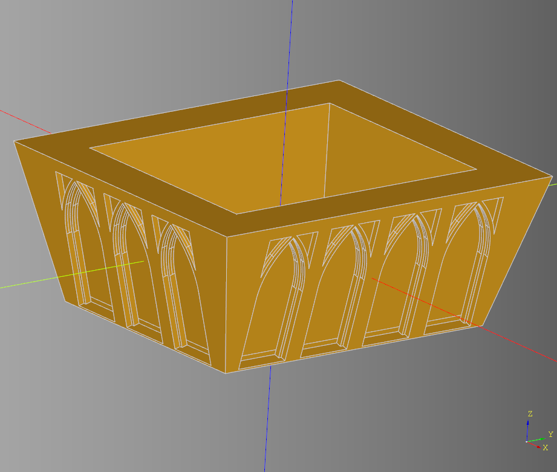

---

## Add a Base

* Add a base to resolve overhang on the bottom of the building.

[Code Example 07 - Base](../example/ex_07_base.py)

### New \_\_init__ Parameters

``` python
self.base_height = 3
self.base = None
```

### Make the base
``` python
def make_base(self):
    self.base = (
        cq.Workplane("XY")
        .box(self.length, self.width, self.base_height)
        .translate((0,0,-1*((self.height/2)+(self.base_height/2))))
    )
```

### Update make
``` python
def make(self):
    super().make()
    self.angle =roof.angle(self.inset, self.height)

    self.make_wedge()
    self.make_interior_rectangle()
    self.make_cut_panels()
    self.make_detail_panels()
    self.make_base()
```

### Update build
``` python
def build(self):
    super().build()
    scene = (
        cq.Workplane("XY")
        .union(self.wedge)
        .cut(self.interior_rectangle)
        .cut(self.cut_panels)
        .union(self.panels)
        .union(self.base)
    )
    return scene
```


---

## Make Window Cut

* Create the outline of the windows and remove the spaces where they will reside.

[Code Example 08 - Window Cut](../example/ex_08_window_cut.py)

### New \_\_init__ Parameters
``` python
self.window_width_offset = -2
self.window_length = 15
self.window_height = 20
self.skip_windows = []

self.cut_windows = None
```

### Make the cut windows

``` python
def make_cut_windows(self):
    height = self.height
    cut_width = self.inset+self.wall_width
    if self.inset < 0:
        cut_width= -1*self.inset

    cut_window = (cq.Workplane("XY").box(self.window_length, cut_width,self.window_height))
    inset = self.inset
    padding = self.panel_padding
    self.cut_windows = self.make_series(
        cut_window,
        length_offset=self.panel_length - self.window_length + self.panel_padding*2,
        x_translate = self.int_length/2+cut_width/2,
        y_translate = self.int_width/2+cut_width/2,
        z_translate=-1*(self.panel_padding), skip_list=self.skip_windows, keep_list=None
    )
```

### Update make
``` python
def make(self):
    super().make()
    self.angle =roof.angle(self.inset, self.height)

    self.make_wedge()
    self.make_interior_rectangle()
    self.make_cut_panels()
    self.make_detail_panels()
    self.make_base()
    self.make_cut_windows()
```

### Update build
``` python
def build(self):
    super().build()
    scene = (
        cq.Workplane("XY")
        .union(self.wedge)
        .cut(self.interior_rectangle)
        .cut(self.cut_panels)
        .union(self.panels)
        .union(self.base)
        .cut(self.cut_windows)
    )
    return scene
```


---

## Add Window Details

* Create the window frames detail

[Code Example 09 - Window Detail](../example/ex_09_window_detail.py)

### Update Import

``` python
from cqterrain import roof, window
```

The code we care about looks like this.
``` python
def frame(length=20, width = 4, height = 40, frame_width=3):
    outline = cq.Workplane("XY").box(length, width, height)
    inline =  cq.Workplane("XY").box(length-(frame_width*2), width, height-(frame_width*2))
    return outline.cut(inline)
```

### New \_\_init__ Parameters

``` python
self.window_frame_width = 2
self.window_frame_chamfer = 1.6
self.window_frame_chamfer_select = "<Z or >Z"
self.windows = None
```

### Create The Frame Example Implementation


``` python
frame = window.frame(self.window_length, cut_width, self.window_height, self.window_frame_width)
frame = frame.faces("Y").edges(self.window_frame_chamfer_select).chamfer(self.window_frame_chamfer)
```


## Create the windows
``` python
def make_windows(self):
    height = self.height
    window_width = self.inset
    if self.inset < 0:
        window_width= -1*self.inset
    elif self.inset == 0:
        window_width = self.wall_width+2

    frame = window.frame(self.window_length, window_width, self.window_height, self.window_frame_width)
    frame = frame.faces("Y").edges(self.window_frame_chamfer_select).chamfer(self.window_frame_chamfer)

    inset = self.inset
    padding = self.panel_padding
    self.windows = self.make_series(
        frame,
        length_offset=self.panel_length - self.window_length + self.panel_padding*2,
        x_translate = self.int_length/2+window_width/2+self.window_width_offset,
        y_translate = self.int_width/2+window_width/2+self.window_width_offset,
        z_translate=-1*(self.panel_padding), skip_list=self.skip_windows, keep_list=None
    )
```

### Update make

``` python
def make(self):
    super().make()
    self.angle =roof.angle(self.inset, self.height)

    self.make_wedge()
    self.make_interior_rectangle()
    self.make_cut_panels()
    self.make_detail_panels()
    self.make_base()
    self.make_cut_windows()
    self.make_windows()
```


### Update build

``` python
def build(self):
    super().build()
    scene = (
        cq.Workplane("XY")
        .union(self.wedge)
        .cut(self.interior_rectangle)
        .cut(self.cut_panels)
        .union(self.panels)
        .union(self.base)
        .cut(self.cut_windows)
        .union(self.windows)
    )
    return scene
```


---

## Testing Window Alternates

``` python
bp = Bunker()
bp.inset=20
bp.width=300
bp.length=120
bp.window_length = 7
bp.window_height = 30
bp.make()
rec = bp.build()
```


``` python
bp = Bunker()
bp.inset=20
bp.width=150
bp.length=120
bp.window_length = 18
bp.window_height = 8
bp.window_frame_chamfer = 1.6
bp.window_frame_chamfer_select = "<Z"
bp.make()
rec = bp.build()
```


---

## Skip Window

[Code Example 10 - Skip Windows](../example/ex_10_skip_windows.py)

The code for skipping series objects was already baked in with example 4.<br />
In order to add doors I need to be able to skip adding the windows at certain indexes. I'd like to be able to set an array of windows to skip [0, 2, 4] and consistently not render those details.

### update \_\_init__ Parameters
``` python
self.skip_windows = [0, 2, 4]
```

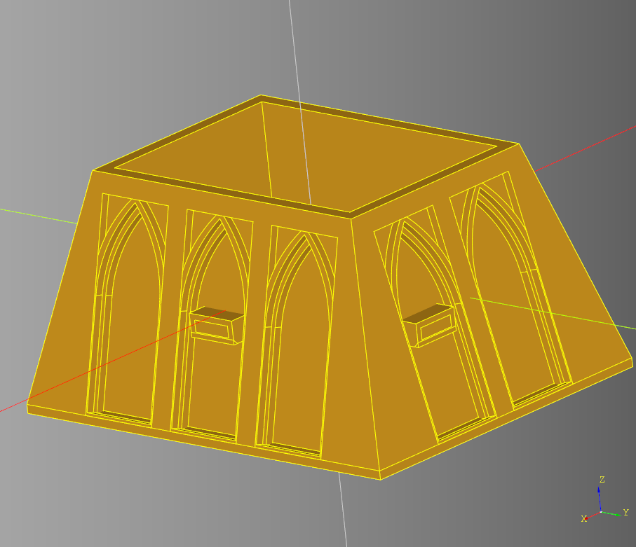

I'm making this look easy, but the ordering in how the solids are added to the workplane and how the solids are rotated matter to have consistent indexes.

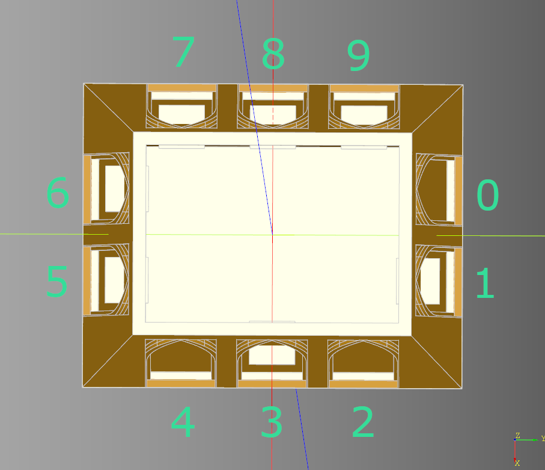

Changing the overall dimensions should keep the same relative indexes.

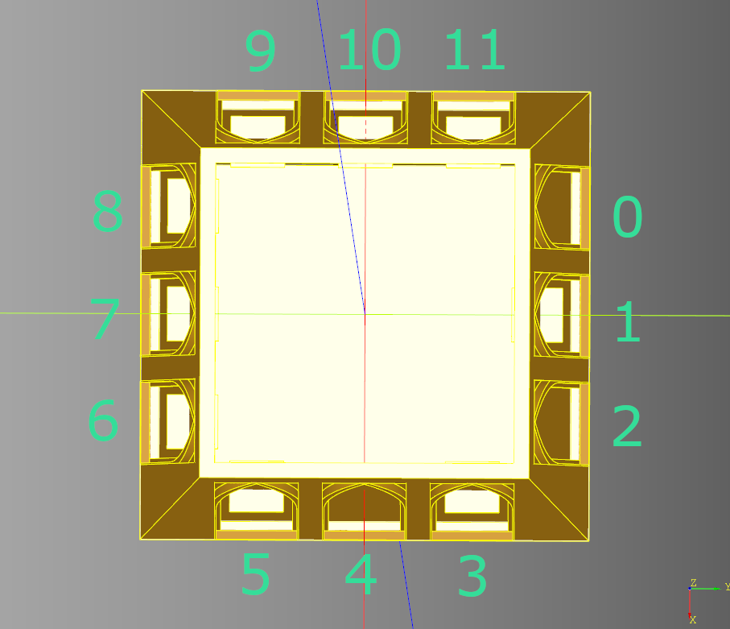

---

## Cut Out The Door

[Code Example 11 - Cut Door](../example/ex_11_cut_door.py)

Follows the same indexing rules as the windows but in this case you are specifying which panels will have doors as opposed to which ones will not.

### Update \_\_init__ Parameters
``` python
self.skip_windows = [0]
```

### New \_\_init__ Parameters
``` python
self.door_panels = [0]
self.door_length = 23
self.door_height =35
self.door_fillet = 4

self.cut_doors = None
```

### Create The Cut Doors
``` python
def make_cut_doors(self):
    height = self.height
    door_cut_width = self.inset+self.wall_width

    if self.inset<0:
        door_cut_width = -1*(self.inset)+self.wall_width

    cut_door = (
        cq.Workplane("XY")
        .box(self.door_length, door_cut_width, self.door_height)
        .edges("|Y").fillet(self.door_fillet)
        .translate((0,0,-1*(height/2 - self.door_height/2)+self.wall_width))
    )

    self.cut_doors = self.make_series(
        cut_door,
        length_offset=self.panel_length - self.door_length + self.panel_padding*2,
        x_translate = self.int_length/2+door_cut_width/2,
        y_translate = self.int_width/2+door_cut_width/2,
        z_translate=0, skip_list=None, keep_list=self.door_panels
    )
```

### Update make
``` python
def make(self):
    super().make()
    self.angle =roof.angle(self.inset, self.height)

    self.make_wedge()
    self.make_interior_rectangle()
    self.make_cut_panels()
    self.make_detail_panels()
    self.make_base()
    self.make_cut_windows()
    self.make_windows()
    self.make_cut_doors()
```

### Update build

``` python
def build(self):
    super().build()

    scene = (
        cq.Workplane("XY")
        .union(self.wedge)
        .union(self.panels)
        .cut(self.cut_doors)
        .cut(self.cut_windows)
        .add(self.base)
        .union(self.windows)
    )
    return scene
```

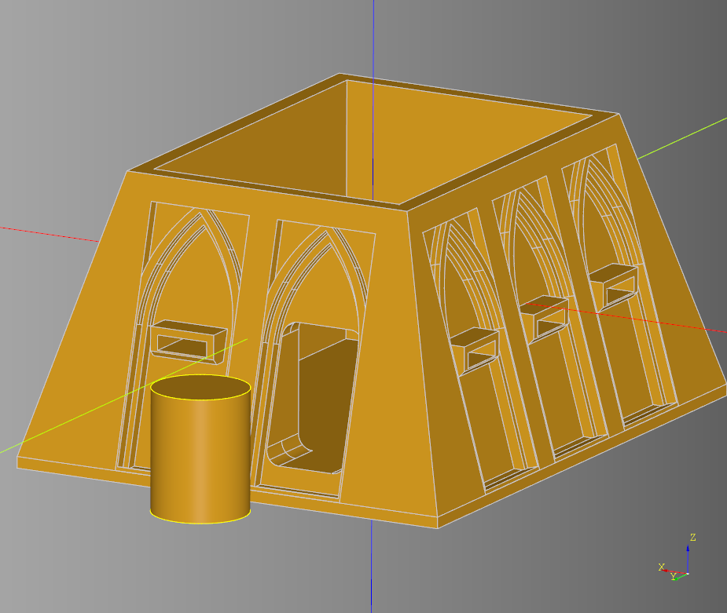

---

## Model The Blast Door
I wrote the blast door as separate base class.
* [Blast Door Code](../src/skirmishbunker/BlastDoor.py)
* [Code Example 12 - Model Blast Door](../example/ex_12_model_blast_door.py)

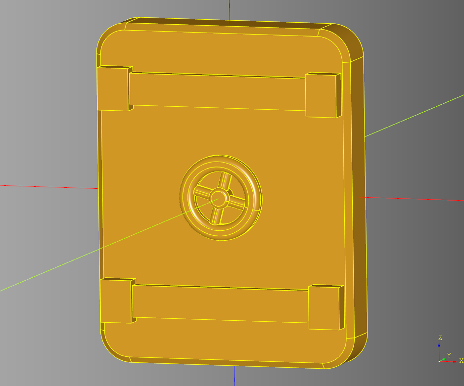

The most interesting bits are the detail methods

### Making the locking bars

#### \_\_init__ params
``` python
self.bar_height = 3
self.bar_width = 1
self.bar_margin_z = 5
self.bar_margin_x = 1.5
self.bar_cap_length = 3
```

#### Bar Detail
``` python
def make_locking_bar(self):
    bar = cq.Workplane("XY").box(self.length-self.bar_margin_x-self.bar_cap_length,self.bar_width,self.bar_height)
    bar = bar.faces("X or -X").box(self.bar_cap_length, self.bar_width+1, self.bar_height+1)
    return bar
```

#### Bar Series
``` python
def make_locking_bars(self):
    bar = self.make_locking_bar()

    offset=self.height-self.bar_height*2- self.bar_margin_z*2
    bars = series(bar, 2, height_offset =offset)

    y_plus = cq.Workplane("XY").add(bars).translate((0,self.width/2+self.bar_width/2,0))
    y_minus = cq.Workplane("XY").add(bars).translate((0,-1*(self.width/2+self.bar_width/2),0))
    result =  cq.Workplane("XY").add(y_plus).add(y_minus)

    self.locking_bars = result
```

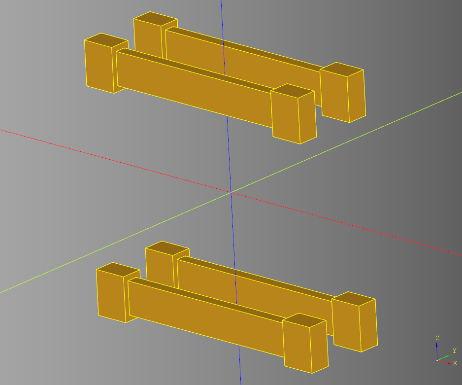


### Making the Handle

#### \_\_init__ params
``` python
self.handle_height = 1.5
self.handle_radius = 4
self.handle_rotation = -15
```

#### Handle code
``` python
def make_handle(self):
    '''
    @todo too many hard coded values
    '''
    outline = cq.Workplane("XY").cylinder(self.handle_height,self.handle_radius)
    interior_cut = cq.Workplane("XY").cylinder(self.handle_height,self.handle_radius-1.5)
    center = cq.Workplane("XY").cylinder(self.handle_height,1).rotate((1,0,0),(0,0,0),90).faces("-Y").fillet(.3)
    spoke = cq.Workplane("XY").box(self.handle_radius*2-1, 1, 1).faces("Y or -Y").fillet(.4)
    handle = (
        cq.Workplane("XY")
        .union(outline)
        .cut(interior_cut)
        .rotate((1,0,0),(0,0,0),90)
        .fillet(.5)
        .union(center)
        .union(spoke)
        .union(spoke.rotate((0,1,0),(0,0,0),90))
    )
    handle = handle
    return handle
```

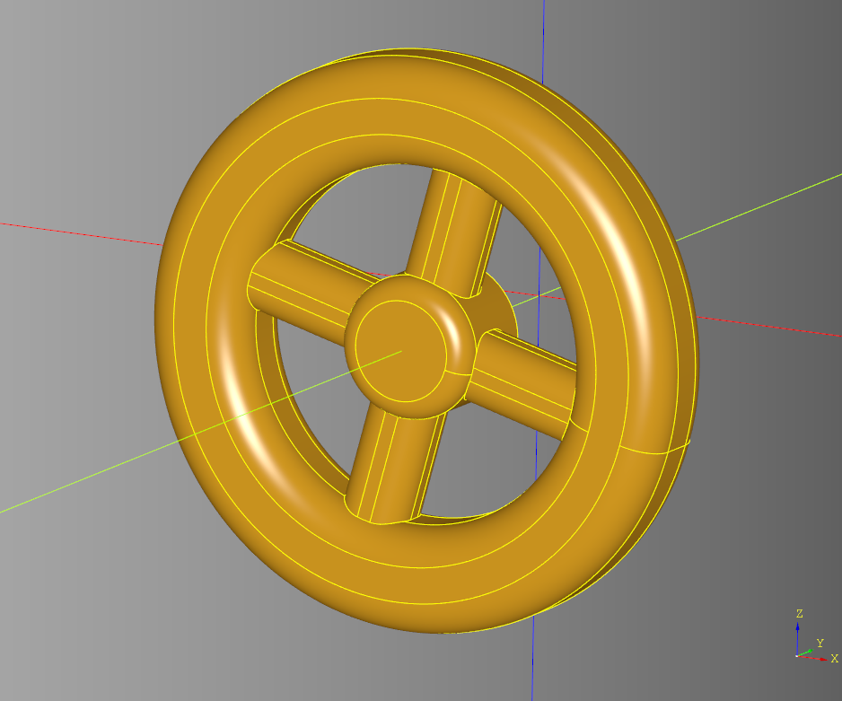

---

## Integrating The Blast Door
Add blast door to the bunker model

[Code Example 13 - Add Blast Door](../example/ex_13_add_blast_door.py)

### New \_\_init__ Parameters
``` python
self.door_panels = [0,3]
self.doors = None
```

### Add The Doors
``` python
def make_doors(self):
    height = self.height
    bp = BlastDoor()
    bp.length = self.door_length
    bp.height = self.door_height
    bp.make()
    door = bp.build().translate((0,0,-1*(height/2 - self.door_height/2)+self.wall_width))

    x_translate = self.int_length/2+bp.width
    y_translate = self.int_width/2+bp.width
    if self.inset < 0:
        x_translate = self.int_length/2+(bp.width/4)
        y_translate = self.int_width/2+(bp.width/4)

    self.doors = self.make_series(
        door,
        length_offset=self.panel_length - self.door_length + self.panel_padding*2,
        x_translate = x_translate,
        y_translate = y_translate,
        z_translate=0, skip_list=None, keep_list=self.door_panels
    )
```

### Create resolver for skipped Windows
The thought process is that you can't have a window on the same panel where you have a door.
``` python
def resolve_window_skip(self):
    skip_list = [] + self.skip_windows
    skip_list = skip_list + self.door_panels
    return skip_list
```

### Update make_cut_windows and make_windows to use resolve_window_skip
#### old
``` python
skip_list=self.skip_windows
```

#### new
``` python
skip_list=self.resolve_window_skip()
```


### Update make
``` python
def make(self):
    super().make()
    self.angle =roof.angle(self.inset, self.height)

    self.make_wedge()
    self.make_interior_rectangle()
    self.make_cut_panels()
    self.make_detail_panels()
    self.make_base()
    self.make_cut_windows()
    self.make_windows()
    self.make_cut_doors()
    self.make_doors()
```

### Update build
``` python
def build(self):
    super().build()
    scene = (
        cq.Workplane("XY")
        .union(self.wedge)
        .cut(self.interior_rectangle)
        .cut(self.cut_panels)
        .union(self.panels)
        .cut(self.cut_doors)
        .union(self.doors)
        .cut(self.cut_windows)
        .union(self.windows)
        .union(self.base)
    )
    return scene
```

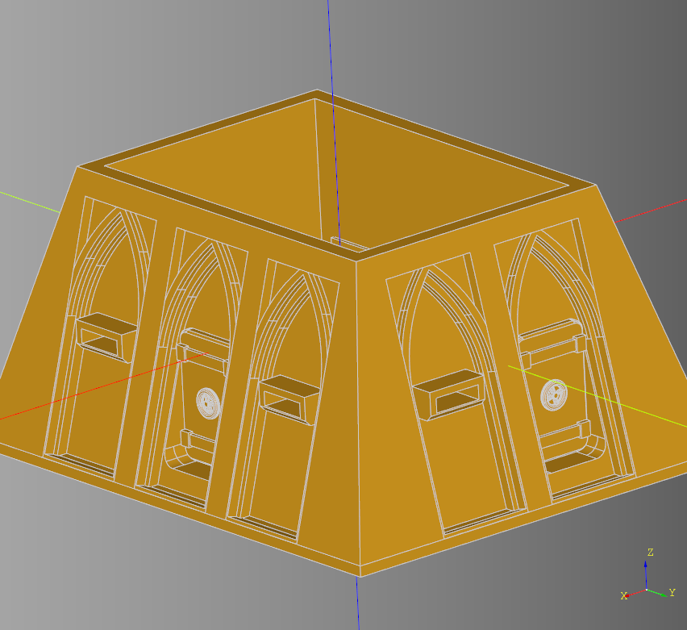
<br />

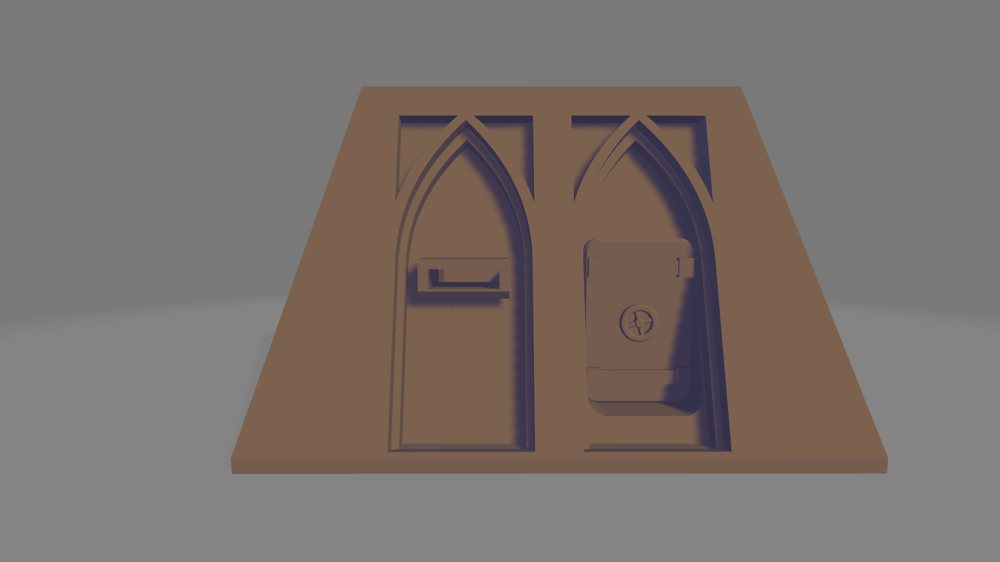

---

## Model The Roof
The Roof is written as a separate base class.

* [Roof Code](../src/skirmishbunker/Roof.py)
* [Code Example 14 - Model Roof](../example/ex_14_model_roof.py)

### Make The Roof Outline
``` python
def make_roof(self):
    self.outline = (
        cq.Workplane("XY" )
        .wedge(self.length,self.height,self.width,self.inset,self.inset,self.length-self.inset,self.width-self.inset)
        .rotate((1,0,0),(0,0,0),-90)
    )

    self.roof = (
        cq.Workplane("XY")
        .add(self.outline)
        .faces("Z").shell(-1*self.wall_width)
    )
```

Uses shell operation to cut out the interior.

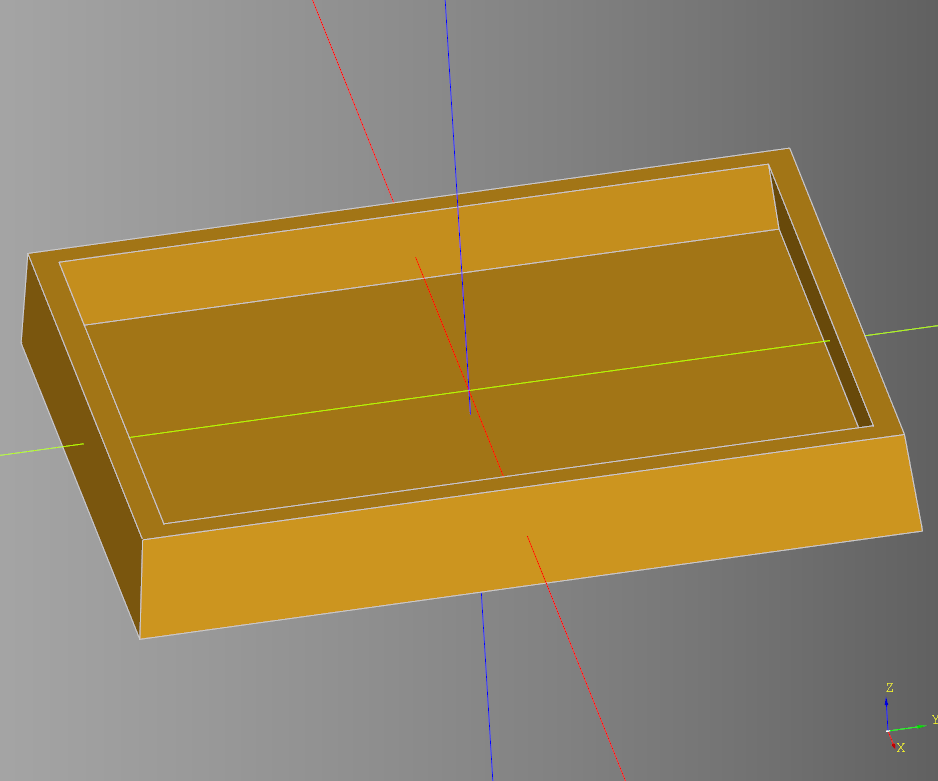

### Make Detail Cuts
``` python
def make_wall_cuts(self):
    x_size = math_floor((self.length-self.inset*2) / 24)*24
    y_size = math_floor((self.width-self.inset*2) / 24)*24

    x_cut = cq.Workplane("XY").box(x_size,self.wall_details_depth,self.height)
    y_cut = cq.Workplane("XY").box(self.wall_details_depth, y_size,self.height)
    inset = self.wall_details_inset

    x_plus = cq.Workplane("XY").add(y_cut).translate(((self.length/2 - 4/2)-inset,0,0))
    x_minus = cq.Workplane("XY").add(y_cut).rotate((0,0,1),(0,0,0),180).translate((-1*(self.length/2 - 4/2)+inset,0,0))

    y_plus = cq.Workplane("XY").add(x_cut).translate((0,(self.width/2 - 4/2)-inset,0))
    y_minus = cq.Workplane("XY").add(x_cut).rotate((0,0,1),(0,0,0),180).translate((0,-1*(self.width/2 - 4/2)+inset,0))

    self.cut_walls = x_plus.add(x_minus).add(y_plus).add(y_minus)
```

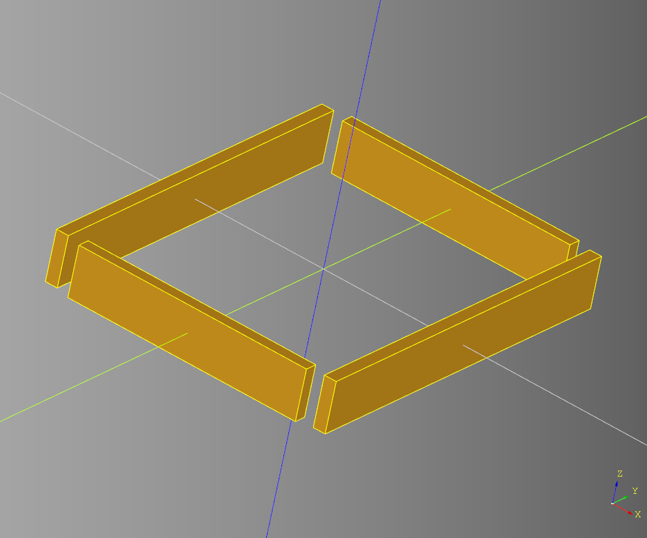

#### Cut From The Roof
``` python
def build(self):
    super().make()
    result = (
        cq.Workplane("XY")
        .union(self.roof)
        .cut(self.cut_walls)
    )
    return result
```

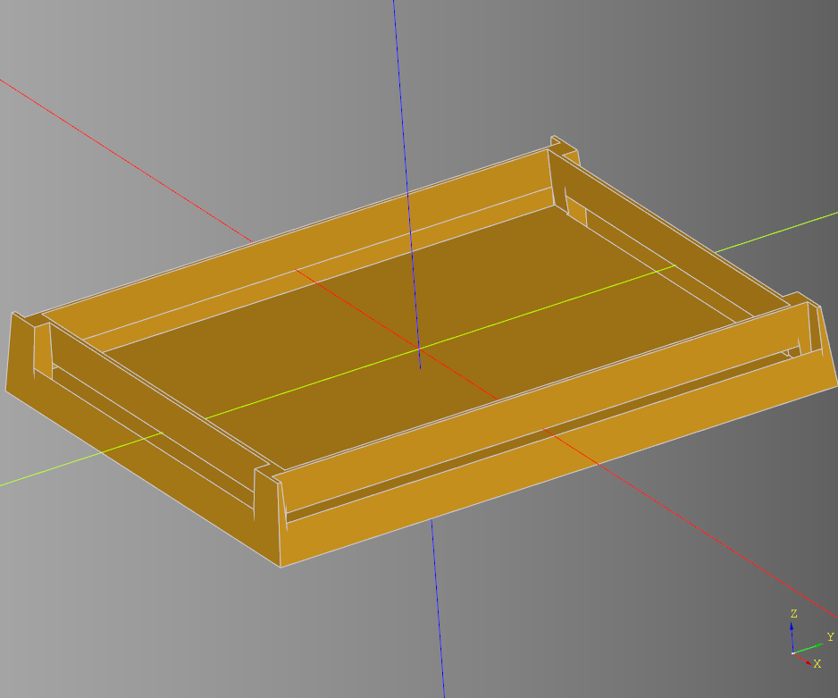

### Make Roof Details

 ``` python
 def make_wall_details(self):
        detail = cq.Workplane("XY").box(20,self.wall_details_depth,self.height).faces("X or -X").box(4, self.wall_details_depth+1, self.height)
        arch = cq.Workplane("XY").box(20-self.wall_details_depth,5,((self.height+1) /4)*3).faces("Z").edges("Y").fillet(self.wall_arch_fillet)
        wall_detail = detail.cut(arch)
        x_size = math_floor((self.length-self.inset*2) / 24)
        y_size = math_floor((self.width-self.inset*2) / 24)

        inset = self.wall_details_inset

        x_series = series(wall_detail, x_size, length_offset=0)
        y_series = series(wall_detail, y_size, length_offset=0).rotate((0,0,1),(0,0,0),90)

        x_plus = cq.Workplane("XY").add(y_series).translate(((self.length/2 - 4/2)-inset,0,0))
        x_minus = cq.Workplane("XY").add(y_series).rotate((0,0,1),(0,0,0),180).translate((-1*(self.length/2 - 4/2)+inset,0,0))

        y_plus = cq.Workplane("XY").add(x_series).translate((0,(self.width/2 - 4/2)-inset,0))
        y_minus = cq.Workplane("XY").add(x_series).rotate((0,0,1),(0,0,0),180).translate((0,-1*(self.width/2 - 4/2)+inset,0))

        #self.wall_details = wall_detail
        self.wall_details = x_plus.add(x_minus).add(y_plus).add(y_minus)
 ```

#### Individual detail
 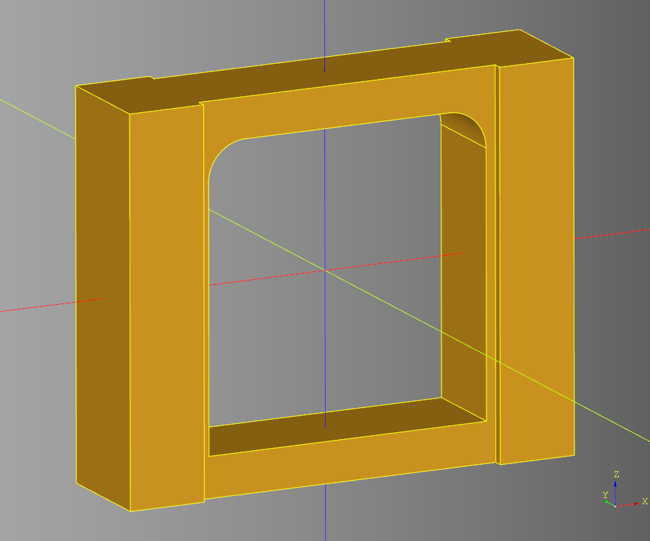

#### Detail series
 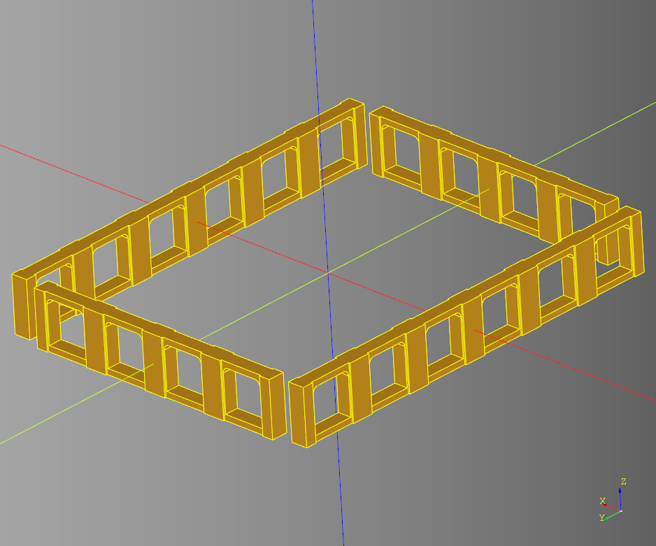

### make Method
``` python
def make(self):
    super().make()
    self.angle =roof.angle(self.inset, self.height)
    self.make_roof()
    self.make_wall_cuts()
    self.make_wall_details()
```

### build Method
``` python
def build(self):
    super().make()
    result = (
        cq.Workplane("XY")
        .union(self.roof)
        .cut(self.cut_walls)
        .union(self.wall_details)
    )
    return result
```

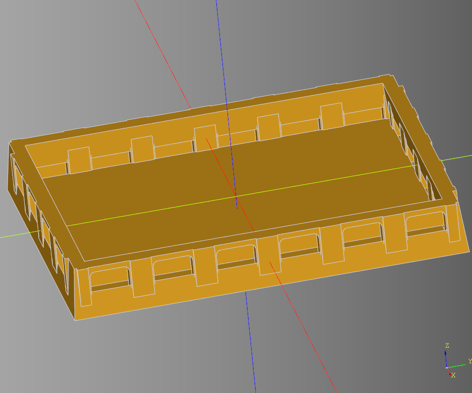

---
## Add Bunker Roof
Give the bunker a roof.

[Code Example 15- Add Roof](../example/ex_15_add_roof.py)

#### \_\_init__ params
``` python
self.roof_height = 18
self.roof_inset = -3
self.roof_overflow = 1
self.roof_wall_details_inset = -0.8
self.roof = None
```

### Add the Roof
``` python
def make_roof(self):
    length = self.length-(2*(self.inset-self.roof_overflow))
    width = self.width-(2*(self.inset-self.roof_overflow))
    bp = Roof()
    bp.height = self.roof_height
    bp.length = length
    bp.width = width
    bp.inset = self.roof_inset
    bp.wall_details_inset = self.roof_wall_details_inset
    bp.make()
    self.roof=bp.build().translate((0,0, self.height/2+bp.height/2))
```

## Update make
``` python
def make(self):
    super().make()
    self.angle =roof.angle(self.inset, self.height)

    self.make_wedge()
    self.make_interior_rectangle()
    self.make_cut_panels()
    self.make_detail_panels()
    self.make_base()
    self.make_cut_windows()
    self.make_windows()
    self.make_cut_doors()
    self.make_doors()
    self.make_roof()
```

## Update build
``` python
def build(self):
    super().build()
    scene = (
        cq.Workplane("XY")
        .union(self.wedge)
        .cut(self.interior_rectangle)
        .cut(self.cut_panels)
        .union(self.panels)
        .cut(self.cut_doors)
        .union(self.doors)
        .cut(self.cut_windows)
        .union(self.windows)
        .union(self.base)
        .union(self.roof)
    )
    return scene
```

### Updated make values.
Now that there is a roof; I can better align with my sample mini (cylinder).
In turn I updated my dimensions.

``` python
bp = Bunker()
bp.inset=15
bp.width=140
bp.length=110
bp.height=65
bp.panel_width = 6
bp.panel_padding = 4

bp.window_length = 18
bp.window_height = 8
bp.window_frame_chamfer = 1.6
bp.window_frame_chamfer_select = "<Z"
bp.make()
rec = bp.build()

show_object(rec)

mini = cq.Workplane("XY").cylinder(32, 12.5).translate((0,89,-1*((68/2))+(32/2)-1.5))
show_object(mini)
```

I chose to make the roof inset negative which means the overhang juts out.

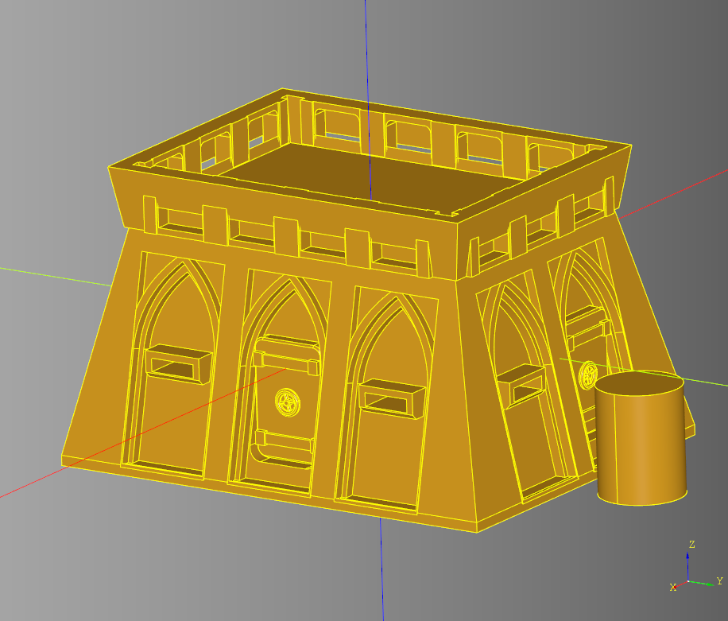

---
## Interior Tile Proof of Concept
Luckily modeling the floor tile has been proven out in other projects.<br />

[Code Example 16a - Tile POC](../example/ex_16a_tile_poc.py)

### cqterrain tile.octagon_with_dots
Part of the [terrain library](https://github.com/medicationforall/cqterrain) that I wrote here is the code for the individual floor tile, that I'm using for the bunker.

``` python
def octagon_with_dots(tile_size=5, chamfer_size = 1.2, mid_tile_size =1.6, spacing = .5 ):
    tile = (cq.Workplane("XY")
            .rect(tile_size,tile_size)
            .extrude(1)
            .edges("|Z")
            .chamfer(chamfer_size) # SET PERCENTAGE
            )

    rotated_tile = tile.rotate((0,0,1),(0,0,0), 45)

    mid_tile = (cq.Workplane("XY")
            .rect(mid_tile_size, mid_tile_size)
            .extrude(1)
            .rotate((0,0,1),(0,0,0), 45)
            )

    tiles = grid.make_grid(tile, [tile_size + spacing,tile_size + spacing], rows=3, columns=3)
    center_tiles = grid.make_grid(mid_tile, [tile_size + spacing, tile_size + spacing], rows=4, columns=4)

    combined = tiles.add(center_tiles).translate((0,0,-1*(1/2)))
    return combined
```

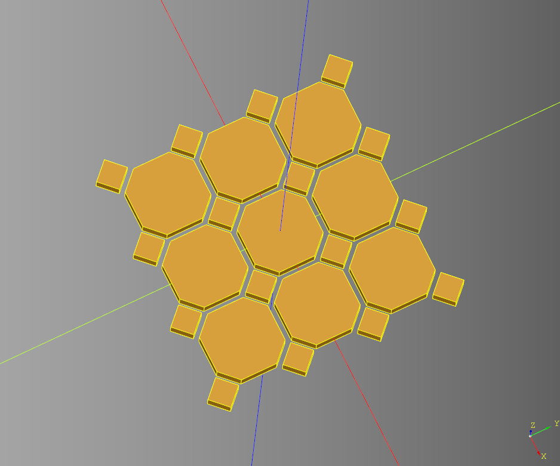<br />

---
## Adding Interior Floor To The Bunker

[Code Example 16b - Internal Floor](../example/ex_16b_int_floor.py)

### Update Imports

``` python
from cadqueryhelper import shape, series, grid
from cqterrain import window, roof, tile
```

### New \_\_init__ Parameters
``` python
  self.render_floor_tiles=True
  self.render_roof=True
  self.interior_tiles = None
```

### Make the floor

``` python
def make_interior_floor(self):
      tile_size = 11
      tile_padding = 1
      int_length = self.length-(2*(self.inset+self.wall_width))-20
      int_width = self.width-(2*(self.inset+self.wall_width))-20

      floor_tile = tile.octagon_with_dots(tile_size, 2.4, 3.2, 1)

      columns = math_floor(int_width/(tile_size + tile_padding))
      rows = math_floor(int_length/(tile_size + tile_padding))
      tile_grid = grid.make_grid(part=floor_tile, dim = [tile_size + tile_padding, tile_size + tile_padding], columns = columns, rows = rows)
      self.interior_tiles = tile_grid.translate((0,0,-1*((self.height/2)-self.wall_width-.5)))
```

### Update make
``` python
def make(self):
    super().make()
    self.angle =roof.angle(self.inset, self.height)

    self.make_wedge()
    self.make_interior_rectangle()
    self.make_cut_panels()
    self.make_cut_doors()
    self.make_detail_panels()
    self.make_base()
    self.make_doors()
    self.make_cut_windows()
    self.make_windows()

    if self.render_roof:
        self.make_roof()

    if self.render_floor_tiles:
        self.make_interior_floor()
```

### Update Build

``` python
def build(self):
    super().build()
    scene = (
        cq.Workplane("XY")
        .union(self.wedge)
        .cut(self.interior_rectangle)
        .cut(self.cut_panels)
        .cut(self.cut_doors)
        .union(self.panels)
        .union(self.base)
        .union(self.doors)
        .cut(self.cut_windows)
        .union(self.windows)
    )

    if self.render_roof:
        scene = scene.add(self.roof)

    if self.render_floor_tiles:
        scene = scene.add(self.interior_tiles)

    return scene
```


### Update Instance Values

``` python
bp = Bunker()
bp.inset=15
bp.width=140
bp.length=110
bp.height=65
bp.panel_width = 6
bp.panel_padding = 4

bp.window_length = 18
bp.window_height = 8
bp.window_frame_chamfer = 1.6
bp.window_frame_chamfer_select = "<Z"
bp.render_floor_tiles=True
bp.render_roof=False
bp.make()
rec = bp.build()

show_object(rec)
```

*Note I turn off the roof rendering for this example.

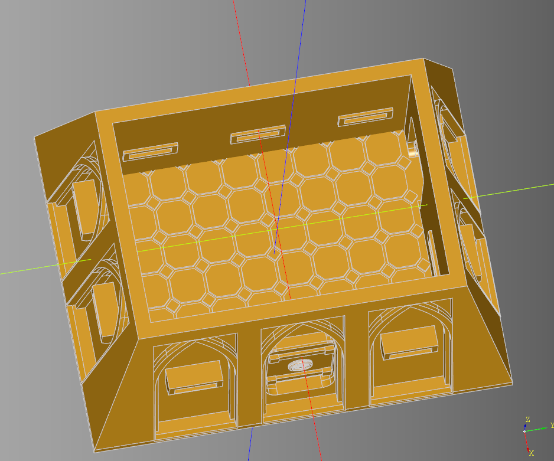<br />


---
## Roof Tile Proof Of Concept
This code hasn't been standardized into a library yet.

[Code Example 17a - Roof Tile POC](../example/ex_19a_roof_tile_poc.py)

``` python
import cadquery as cq

tile_size = 21
tile_padding = 2

tile = cq.Workplane("XY").box(tile_size, tile_size, 2)
slot = cq.Workplane("XY").slot2D(tile_size,2).extrude(2).rotate((0,0,1),(0,0,0),45)
slot2 = cq.Workplane("XY").slot2D(tile_size-7,2).extrude(2).rotate((0,0,1),(0,0,0),45).translate((-3,-3,0))
slot3 = cq.Workplane("XY").slot2D(tile_size-7,2).extrude(2).rotate((0,0,1),(0,0,0),45).translate((3,3,0))
slot4 = cq.Workplane("XY").slot2D(tile_size-7-7,2).extrude(2).rotate((0,0,1),(0,0,0),45).translate((-3-3,-3-3,0))
slot5 = cq.Workplane("XY").slot2D(tile_size-7-7,2).extrude(2).rotate((0,0,1),(0,0,0),45).translate((3+3,3+3,0))

tile = tile.cut(slot).cut(slot2).cut(slot3).cut(slot4).cut(slot5)

show_object(tile)
```

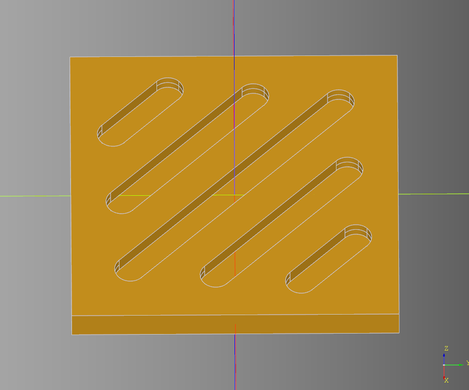<br />

---
## Add Roof Tiles
Modify the roof class to add floor tiles.

[Code Example 17b - Roof Tile](../example/ex_17_roof_tile.py)

### Update Imports

``` python
from cadqueryhelper import shape, series, grid
from cqterrain import window, roof, tile
```

### New \_\_init__ Parameters
``` python
  self.render_floor_tiles = True
  self.roof_tiles = None
```

### Make The Floor Tiles

``` python
def make_floor_tiles(self):
    tile_size = 21
    tile_padding = 2

    int_length = self.length-(2*(self.inset+self.wall_width))
    int_width = self.width-(2*(self.inset+self.wall_width))

    tile = cq.Workplane("XY").box(tile_size, tile_size, 2)
    slot = cq.Workplane("XY").slot2D(tile_size,2).extrude(2).rotate((0,0,1),(0,0,0),45)
    slot2 = cq.Workplane("XY").slot2D(tile_size-7,2).extrude(2).rotate((0,0,1),(0,0,0),45).translate((-3,-3,0))
    slot3 = cq.Workplane("XY").slot2D(tile_size-7,2).extrude(2).rotate((0,0,1),(0,0,0),45).translate((3,3,0))
    slot4 = cq.Workplane("XY").slot2D(tile_size-7-7,2).extrude(2).rotate((0,0,1),(0,0,0),45).translate((-3-3,-3-3,0))
    slot5 = cq.Workplane("XY").slot2D(tile_size-7-7,2).extrude(2).rotate((0,0,1),(0,0,0),45).translate((3+3,3+3,0))

    tile = tile.cut(slot).cut(slot2).cut(slot3).cut(slot4).cut(slot5)

    columns = math_floor(int_width/(tile_size + tile_padding))
    rows = math_floor(int_length/(tile_size + tile_padding))
    tile_grid = grid.make_grid(part=tile, dim = [tile_size + tile_padding, tile_size + tile_padding], columns = columns, rows = rows)

    self.roof_tiles = tile_grid.translate((0,0,-1*((self.height/2)-self.wall_width-1)))
    #self.roof_tiles = tile_grid
```

### Update make
``` python
def make(self):
    super().make()
    self.angle =roof.angle(self.inset, self.height)
    self.make_roof()
    self.make_wall_cuts()
    self.make_wall_details()

    if self.render_floor_tiles:
        self.make_floor_tiles()
```

### Update build
``` python
def build(self):
    super().make()
    result = (
        cq.Workplane("XY")
        .union(self.roof)
        .cut(self.cut_walls)
        .union(self.wall_details)
    )

    if self.render_floor_tiles:
        result = result.add(self.roof_tiles)
    return result
```

### Update Instance Values

``` python
bp = Roof()
bp.length = 110
bp.width = 140
bp.height = 20
bp.inset = -3
bp.wall_details_inset = -0.8
bp.render_floor_tiles = True
bp.make()
roof = bp.build()
```

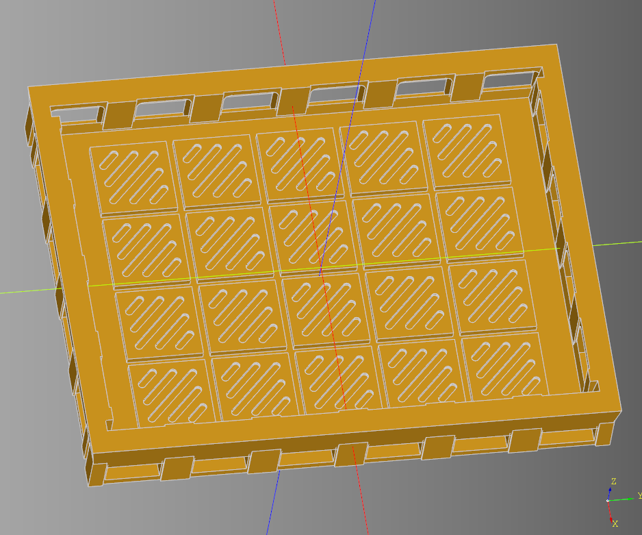<br />


---

## Build Plate
Added another lifecycle method called **build_plate**. With the idea being that you have **build** for the assembled build.
And **build_plate** for the physical print built of the individual parts.

[Code Example 18 - Build Plate](../example/ex_18_build_plate.py)


### Update make_roof
``` python
def make_roof(self):
    length = self.length-(2*(self.inset-self.roof_overflow))
    width = self.width-(2*(self.inset-self.roof_overflow))

    print('roof length', length)
    print ('roof width', width)
    bp = Roof()
    bp.height = self.roof_height
    bp.length = length
    bp.width = width
    bp.inset = self.roof_inset
    bp.wall_details_inset = self.roof_wall_details_inset
    bp.render_floor_tiles = self.render_floor_tiles
    bp.make()
    self.roof=bp.build().translate((0,0, self.height/2+bp.height/2))
```

### Add build_plate methods
``` python
def build_plate(self):
    x_translate = self.length

    if self.inset < 0:
        x_translate = self.length+(-1*(self.inset*2))
    if self.inset == 0:
        x_translate = self.length+15

    if self.render_roof and self.roof:
        self.roof = self.roof.translate((x_translate,0,-1*(self.height+self.base_height)))
    return self.build()
```

<br />

---
## Feature Toggles

The Builds are starting to get heavy and to enable testing in isolation I added feature toggles to disable / enable details of the bunker.

[Example 21 - Feature Toggles](../example/ex_21_feature_toggles.py)


--
## Ladders

Added the ladder interior detail part.
